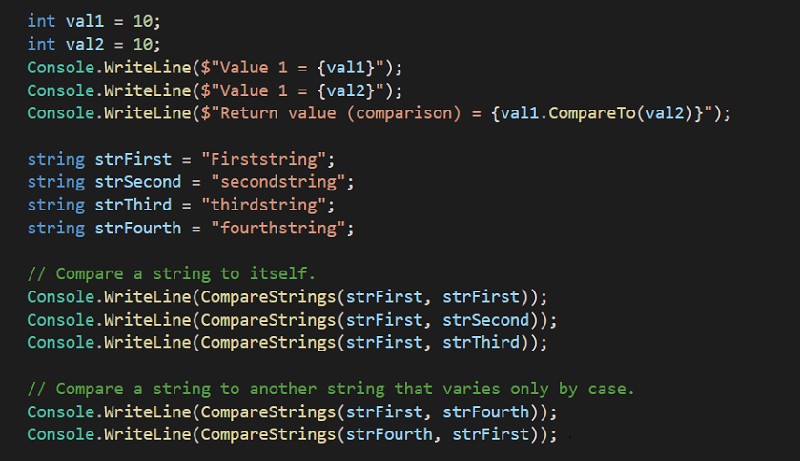

# 5. Comparing between ==, Equals, ReferenceEquals and CompareTo #

- We use Equality operators/methods to compare two or more values with each other.
- There are 4 methods of checking the equivalence of the objects:
    1. Equality operator ==
    2. Equals()
    3. ReferenceEquals()
    4. CompareTo()

## Value equality ##

- Value equality means that two objects contain the same value or values.

### 1. Equality operator == ###

- We Use **== operator**  to check if both objects point to the same location or not.
- The equality operator == returns true if its operands are equal, false otherwise.
- **Example** :Consider the following code.

     

- Here, we are comparing com variable and c variable. The if statement returns true if both are equal(which is happening in this example), otherwise it returns false.
- The output of the above code :

    

### 2. Equals() ###

- In C#, Equals(String, String) is a String method.
- It is used to determine whether two String objects have the same value or not.
- Basically, it checks for equality. If both strings have the same value, it returns true otherwise returns false.
- This method is different from Compare and CompareTo methods. This method compares two string on the basis of contents.
- Equals() method are used to compare two value type data items or reference type data items.the Equals() method   compares the contents of a string.
- Equals() method compares only contents.
- **Syntax** bool string.Equals(string str1, string str2);
**Parameters**:
    1. str1: It is the first string to compare.
    2. str2: It is the second string to compare.

- **Example** : Consider the following code.

    

- The output of the above code :

    

### 3. ReferenceEquals() ###

- Object.ReferenceEquals() Method is used to determine whether the specified Object instances are the same instance or not.
- This method cannot be overridden. So, if a user is going to test the two objects references for equality and he is not sure about the implementation of the Equals method, then he can call the ReferenceEquals method.
- **Syntax** : public static bool ReferenceEquals (object ob1, object ob2);
- **Parameters**:
    1. ob1: It is the first object to compare.
    2. ob2: It is the second object to compare.

- **Return Value** : This method returns true if ob1 is the same instance as ob2 or if both are null otherwise, it returns false.

- **Example** : Consider the following code.

    

- The output of the above code :

    

### 4. CompareTo() ###

- **CompareTo(String)** :
- Compares this instance with a specified String object and indicates whether this instance 
precedes, follows, or appears in the same position in the sort order as the specified string.
- **Parameters to be passed** :
    1. str String
    2. The string to compare with this instance.
- It will return the following:

     - **Int32** : A 32-bit signed integer that indicates whether this instance precedes, follows, or appears in the same position in the sort order as the strB parameter.
- **RETURNS** :

Value | Condition
------------ | -------------
Less tha zero | This instance precedes strB.
Zero | This instance has the same position in the sort order as strB.
Greater than zero | This instance follows str. or str is null.

- **CompareTo(Object)** :
- Compares this instance with a specified Object and indicates whether this instance 
precedes, follows, or appears in the same position in the sort order as the specified Object.
- **Parameter to be Passed** :
    1. value Object
    2. An object that evaluates to a String.
- **Returns** :
- - **Int32** : A 32-bit signed integer that indicates whether this instance precedes, follows, or appears in the same position in the sort order as the value parameter.
- **RETURNS** :

Value | Condition
------------ | -------------
Less tha zero | This instance precedes value.
Zero |This instance has the same position in the sort order as value.
Greater than zero | This instance follows value. OR value is null.

- **Example** : Consider the following code.

    

- function used :

    

- The output of the above code :

    

- **Remark** : This method performs a word (case-sensitive and culture-sensitive) comparison using the current culture.